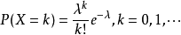

# 概率论

## 常见分布

### 二项分布

二项分布就是重复n次独立的伯努利试验。

> 伯努利试验
> 
> 伯努利试验（Bernoulli experiment）是在同样的条件下重复地、相互独立地进行的一种随机试验，其特点是该随机试验只有两种可能结果：发生或者不发生。
> 
> 我们假设该项试验独立重复地进行了n次，那么就称这一系列重复独立的随机试验为n重伯努利试验，或称为伯努利概型。

一般地，在n次独立重复试验中，ξ表示事件A发生的次数。如果事件A发生的概率是p，则不发生的概率 q=1-p，n次独立重复试验中，事件A发生k次的概率是：P(ξ=k)=  (k=0,1,2,3…n），那么就说ξ服从参数p的二项分布，其中p称为成功概率。记作：ξ~B(n,p)。

1. 二项分布ξ的期望：Eξ=np；
2. 二项分布ξ的方差：Dξ=npq。

0-1分布就是n=1的二项分布

p=q时概率直方图是对称的，当p≠q时，直方图呈偏态，p < q 与 p > q的偏斜方向相反。如果n很大，即使p≠q，偏态逐渐降低，最终成正态分布，二项分布的极限分布为正态分布。故当n很大时，二项分布的概率可用正态分布的概率作为近似值。何谓n很大呢?一般规定：当 p < q 且 np≥5，或 p > q 且 nq≥5，这时的n就被认为很大，可以用正态分布的概率作为近似值了。

### 泊松分布

Poisson distribution，离散概率分布，法国数学家西莫恩·德尼·泊松（Siméon-Denis Poisson）在1838年时发表。

概率函数：
泊松分布的参数λ是单位时间(或单位面积)内随机事件的平均发生次数。 泊松分布适合于描述单位时间内随机事件发生的次数。
泊松分布的期望和方差均为λ

> 当二项分布的n很大而p很小时，泊松分布可作为二项分布的近似，其中λ为np。通常当n≧20,p≦0.05时，就可以用泊松公式近似得计算。
> 事实上，泊松分布正是由二项分布推导而来的